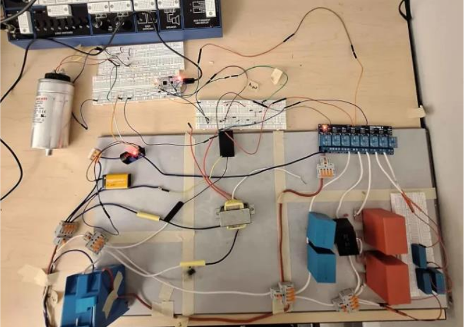
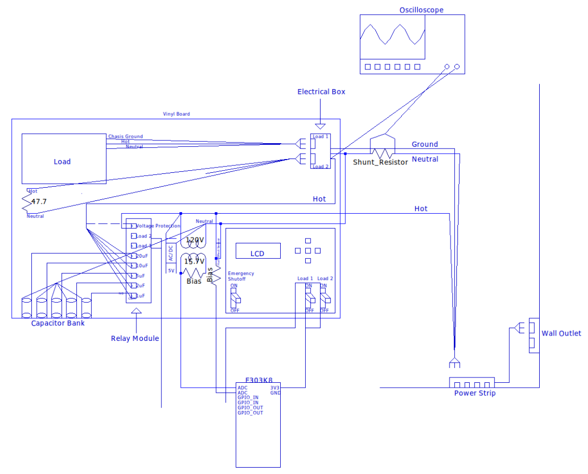
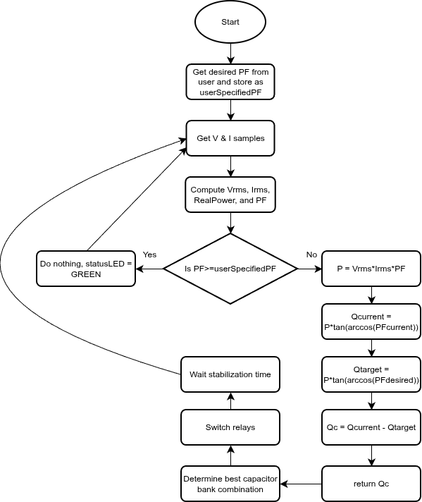
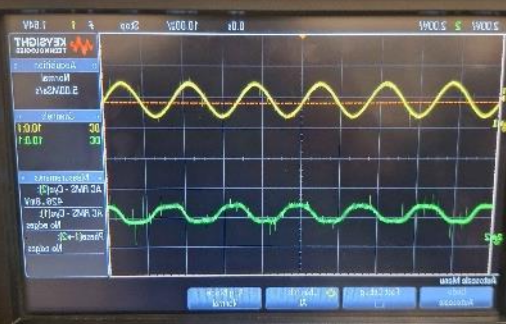
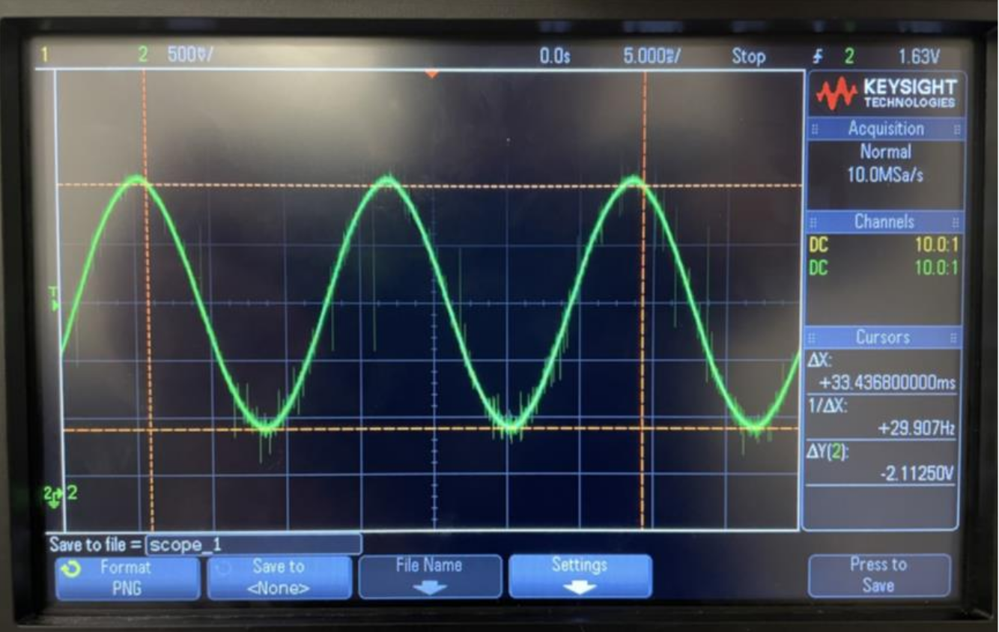
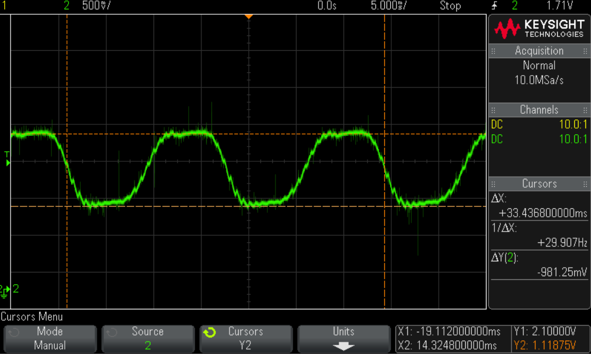
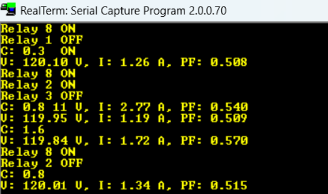

# Power-Factor-Correction-System
> ⚠️ **Safety Notice:** This project involves 120V AC mains voltage. Do not replicate without proper training, equipment, and supervision.`

<table>
  <tr>
    <td align="center" width="50%">
      
       Assembled APFC module
    </td>
    <td align="center" width="50%">
      
       Full System Schematic
    </td>
  </tr>
</table>

Table of Contents
=================
* [Power-Factor-Correction-System](#power-factor-correction-system)
   * [Introduction](#introduction)
   * [Problem Definition](#problem-definition)
   * [Engineering Requirements](#engineering-requirements)
   * [Firmware Design and Implementation](#firmware-design-and-implementation)
   * [Results](#results)
      * [Qualitative Performance Assessment](#qualitative-performance-assessment)
         * [Waveform Captures](#waveform-captures)
      * [Limitations and Uncompleted Testing](#limitations-and-uncompleted-testing)
   * [License](#license)
   * [Questions?](#questions)

## Introduction
Power factor correction (PFC) is an important part of maintaining efficiency and stability in commercial and industrial electrical systems. Inductive loads like motors, HVAC equipment, and pumps cause power factor to drop, which increases current draw and wastes energy. Automatic PFC (APFC) systems fix this by monitoring the phase difference between voltage and current waveforms and adding capacitance to bring the power factor near unity.

**Project Goal:** Design and build a portable, low-cost single-phase APFC module for small to mid-sized commercial facilities. The system measures voltage and current on a single line, calculates the power factor, and automatically switches in capacitors for correction.

## Problem Definition
Most modern PFC systems rely on accurate sensing of both voltage and current waveforms to calculate phase angle. Current transformers (CTs) and voltage transformers (VTs) are the standard sensing methods because they provide electrical isolation and output low-voltage AC signals safe to interface with measurement circuits. For voltage measurement, modules like the ZMPT101B offer isolated, scaled-down AC line waveforms suitable for ADC conversion.

Once stepped down, signals require conditioning before entering a microcontroller: buffering, low-pass filtering, and DC offset adjustment keep the entire AC waveform within the ADC's range.

**The Gap:** While industrial APFC cabinets are common, they're large, high-power systems built for factories. Smaller, portable APFC modules are under-researched. Existing hardware either focuses on basic monitoring or is too expensive and bulky for small to mid-sized commercial users.

Small businesses relying on three-phase power often experience low power factor from heavy inductive loads, which results in increased current draw, reduced efficiency, and potential utility penalties. There's a clear need for a modular, lower-cost, easy-to-install solution.

**Our Objective:** Build a single-phase APFC module that measures voltage and current, calculates power factor, and automatically switches in capacitors to correct to near unity. The module will be portable, cost-effective compared to existing solutions, easily installable, and suitable for small to mid-sized commercial facilities.

## Engineering Requirements

Full requirements specification with 49 technical requirements across all subsystems is available in the documentation:

**[View Complete Requirements Specification](docs/requirements.md)**

## Firmware Design and Implementation

**[View Main Loop Code](firmware/main.c)**

The firmware for the system is implemented on an STM32-F303K8 microcontroller and handles data acquisition, signal processing, power factor calculation, and capacitor bank control. Source files are located in `/firmware/` repository directory.

At startup, the system initializes all peripherals: ADC with DMA, timers, GPIO pins for relay control, UART for debugging, and I2C for the LCD interface. Once initialized, the ADC starts in DMA mode and continuously collects voltage and current samples triggered by a timer.

When the ADC buffer fills, the main processing routine executes:

1. DC offset removal from sampled signals
2. RMS voltage and current computation
3. Real and apparent power calculation
4. Instantaneous power factor determination

A simple moving average filter stabilizes the power factor reading. Protection logic disables the capacitor bank and triggers a fault state if voltage or current levels fall outside acceptable ranges.

The control algorithm compares measured power factor to a 0.95 target. If outside the defined deadband, required reactive power compensation is calculated. The controller determines the appropriate capacitor combination using a binary-based relay control scheme.

Relay signals update to adjust the capacitor bank, and system status (voltage, current, power factor) transmits over UART for monitoring. The process repeats continuously.

## Results

The primary outcome was successful assembly and operation of a single-phase Automatic Power Factor Correction (APFC) prototype. While comprehensive quantitative testing was not completed due to timeline constraints, the system demonstrated core functionality during demonstration and informal testing.

### Qualitative Performance Assessment

During informal testing with an inductive motor load, the following behaviors were observed:

|Observation|Result|
|---|---|
|**Correction Behavior**|MCU activation reduced phase difference between voltage and current on oscilloscope, indicating improved power factor|
|**System Stability**|Prototype operated continuously without fault conditions or relay chatter|
|**Display Output**|Terminal displayed correct feedback on system status and capacitor bank configuration|

#### Waveform Captures & Terminal Output
<table>
  <tr>
    <td align="center" width="50%">
      
       <b>Figure 1:</b> Voltage (top) and Current (bottom) from probing motor directly
    </td>
    <td align="center" width="50%">
      
       <b>Figure 2:</b> Voltage waveform after step-down, DC-bias, and RC filter
    </td>
  </tr>
  <tr>
    <td align="center" width="50%">
      
       <b>Figure 3:</b> Current waveform after DC-bias and RC filter
    </td>
    <td align="center" width="50%">
      
       <b>Figure 4:</b> Terminal output displaying automatic switching and voltage/current/PF readings
    </td>
  </tr>
</table>

### Limitations and Uncompleted Testing

Comprehensive quantitative testing was limited by project timeline constraints. The following test plans were not fully executed:

- Voltage divider ratio verification with calibrated equipment
- Current measurement accuracy across full 0.5–5 A range
- ADC sampling rate verification with oscilloscope
- Relay in-rush current measurement
- Formal PF correction verification with multiple load conditions
- Power supply ripple and isolation testing

## License

This project is licensed under the MIT License — see [`LICENSE`](LICENSE) file for details.

## Questions?

Open an issue or reach out directly. Happy to discuss the implementation!
